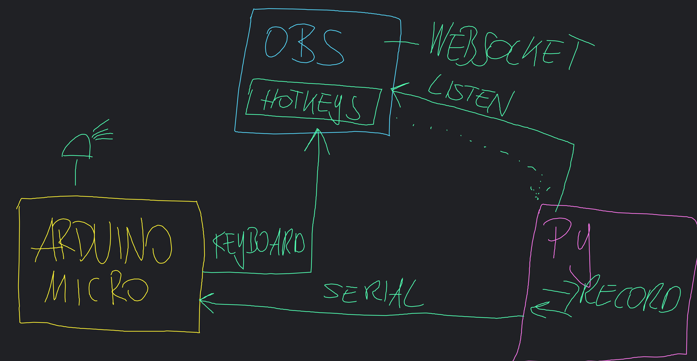
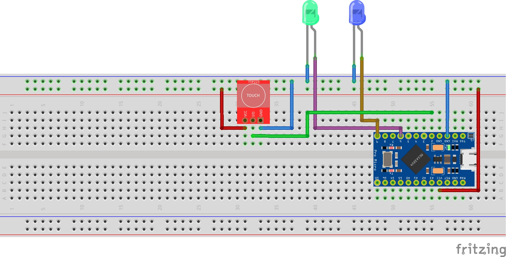
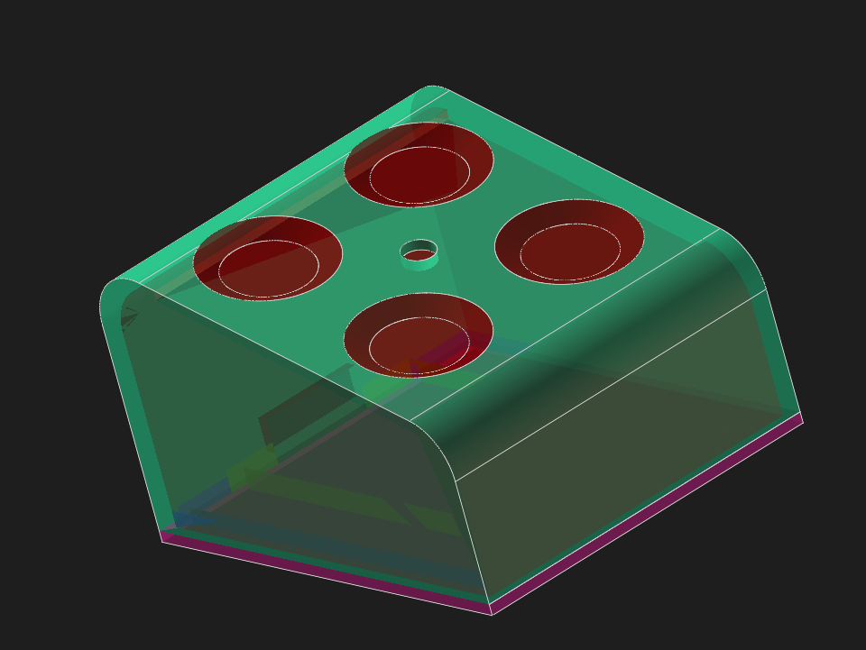

# DIY Hotkey mit Arduino Mikro und OBS Websocket-Anbindung

Es gibt 3 Arduino und 2 Python Files, damit das Projekt in Etappen aufgebaut werden kann.

## Quickstart

* Websocket-Server Daten in OBS holen und in ws_live.py eintragen
* OBS starten
* `python3 ws_live.py`starten und im Hintergrund laufen lassen
* Arduino flashen und via USB verbinden
* OBS Aktionen mittels Button/Arduino steuern und sich über LED Visualsierung freuen

## Verdrahtung

## IDEE und Programmablauf
* Arduino Mikro ist per USB mit PC Verbunden
* Mit Button wird Tastenkombination zu PC übermittelt -> OBS Hotkey triggert Aktion
* Visualisieren von Aufnahme / Pause / Resume von OBS
* Per Python wird via Websocket der aktuelle Status ausgelesen und via Serial zu Arduino gesendet
* Je Aktion "rekord", "resume", "pause" etc. gibt es eine LED zur Visualsierung

## Arduino Keyboard.h 
https://www.arduino.cc/reference/en/language/functions/usb/keyboard/keyboardmodifiers/

## OBS
Unter Werkzeuge -> Websocket-Server Einstellungen gibt es Konfigurationsmöglichkeiten. 

## Warum kein ESP32?
USB-Verbindung war mir in dem Fall wichtiger als per BLE die Keyboard Aktionen zu übermitteln. 

## 3D Case / STL

https://www.printables.com/de/@pixelEDI_563201
Wurde mit SovleSpace umgesetzt.

Viel Spaß beim Nachbauen
** https://links.pixeledi.eu **
